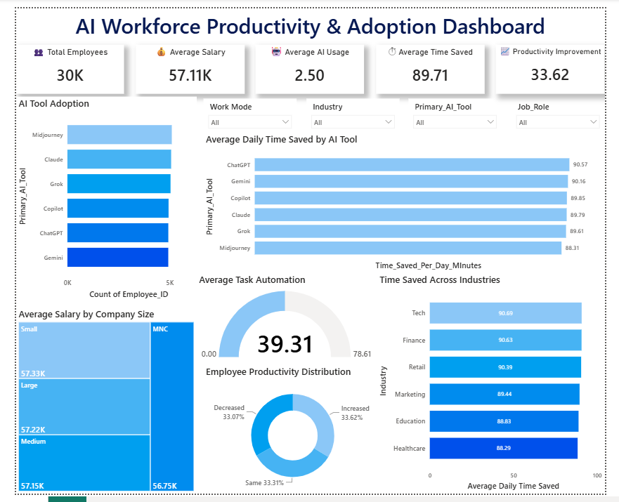

# 🤖 AI Workforce Productivity & Adoption Dashboard

> An end-to-end Data Analytics project that analyzes the impact of Artificial Intelligence on employee productivity using **SQL, Python, and Power BI**.


---

# 📖 Project Overview

Artificial Intelligence is rapidly transforming workplaces by automating repetitive tasks, improving operational efficiency, and supporting better decision-making. However, many organizations still struggle to measure the actual business impact of AI adoption.

This project builds an **interactive AI Workforce Productivity & Adoption Dashboard** to analyze how AI tools influence employee productivity, time savings, task automation, and workforce performance.

The complete analytics pipeline was developed using **SQL**, **Python**, and **Power BI**, demonstrating an end-to-end data analytics workflow from raw data to business insights.

---

# 🎯 Problem Statement

Organizations increasingly adopt AI tools, but measuring their impact on workforce productivity remains a major challenge.

### Business Challenges

- Difficult to measure AI's impact on employee productivity.
- No centralized dashboard for AI adoption analysis.
- Lack of insights into time saved through AI.
- Difficulty evaluating employee satisfaction.
- Decision-makers lack data-driven AI investment insights.

---

# 🎯 Project Objectives

- Analyze AI adoption across organizations.
- Measure employee productivity improvements.
- Evaluate task automation levels.
- Compare different AI tools.
- Measure daily time savings.
- Analyze employee satisfaction.
- Build an interactive Power BI dashboard for business decision-making.

---

# 🛠 Tech Stack

| Technology | Purpose |
|------------|----------|
| SQL (MySQL) | Database Creation & Data Cleaning |
| Python | Exploratory Data Analysis |
| Pandas | Data Manipulation |
| NumPy | Numerical Analysis |
| Matplotlib | Data Visualization |
| Seaborn | Statistical Visualization |
| Power BI | Interactive Dashboard |

---

# 📂 Dataset Information

### Dataset Size

- 👥 **30,000 Employee Records**

### Dataset Includes

- Employee ID
- Industry
- Job Role
- Company Size
- Salary
- AI Tool Used
- Daily AI Usage Hours
- Time Saved
- Productivity Change
- Job Satisfaction
- Task Automation %
- Experience
- Promotion Status
- Remote Work Type

---

# 🔄 Project Workflow

```text
Raw Dataset
      │
      ▼
SQL Database Creation
      │
      ▼
Data Cleaning & Validation
      │
      ▼
Python Exploratory Data Analysis
      │
      ▼
Business Insights
      │
      ▼
Power BI Dashboard
      │
      ▼
Business Recommendations
```

---

# 🗄 SQL Implementation

SQL was used to build a clean and analysis-ready dataset.

### Tasks Performed

✔ Database Creation

✔ Table Creation

✔ CSV Import

✔ Duplicate Removal

✔ NULL Value Handling

✔ Remove Extra Spaces

✔ Data Validation

✔ Data Cleaning

✔ Data Transformation

---

# 🐍 Exploratory Data Analysis (Python)

Exploratory Data Analysis (EDA) was performed using:

- Pandas
- NumPy
- Matplotlib
- Seaborn

### Analysis Performed

- Employee Age Distribution
- Salary Distribution
- Industry Distribution
- Company Size Analysis
- AI Tool Adoption
- Remote Work Analysis
- AI Usage Hours
- Daily Time Saved
- Task Automation
- Productivity Changes
- Job Satisfaction
- Fear of AI Replacement
- Correlation Heatmap

---

# 📊 Power BI Dashboard

The dashboard provides an interactive overview of AI adoption and workforce productivity.

## KPI Cards

- 👥 Total Employees
- 💰 Average Salary
- 🤖 Average AI Usage
- ⏱ Average Time Saved
- 📈 Productivity Improvement
- ⚙ Average Task Automation

---

## Dashboard Visualizations

- KPI Cards
- Horizontal Bar Charts
- Donut Charts
- Gauge Chart
- Treemap
- Interactive Slicers
- Comparative Analysis Charts

---

## Interactive Filters

Users can filter dashboard insights by:

- Industry
- Primary AI Tool
- Job Role
- Work Mode

---

# 📈 Key Business Insights

- AI adoption was analyzed across **30,000 employees**.
- Employees save approximately **90 minutes every day** through AI.
- **ChatGPT** delivers the highest average time savings.
- Around **39% of routine tasks** are automated using AI.
- Technology and Finance industries benefit the most from AI adoption.
- Overall employee productivity increased by **33.62%**.
- AI improves operational efficiency regardless of company size.

---


```
## 📊 Dashboard Preview


```

---

# 📁 Project Structure

```text
AI-Workforce-Productivity-Adoption-Dashboard/
│
├── 📄 README.md                           # Project documentation
│
├── 📊 Final_Cleaned_Data.csv              # Cleaned dataset used for analysis
│
├── 🗄️ Ai productivity analysis.sql         # SQL queries for database creation and data cleaning
│
├── 🐍 Ai productivity analysis python.ipynb # Python notebook for EDA and visualization
│
├── 📈 ai productivity dashboard.pbix      # Power BI dashboard
│
├── 🖼️ Dashboard.png                       # Dashboard preview image

```

---

# ▶ How to Run This Project

## Step 1

Clone the repository

```bash
git clone https://github.com/yourusername/AI-Workforce-Productivity-Adoption-Dashboard.git
```

---

## Step 2

Install Python libraries

```bash
pip install pandas numpy matplotlib seaborn
```

---

## Step 3

Run the Python Notebook

```text
Python/
    Ai productivity analysis.ipynb
```

---

## Step 4

Execute SQL Scripts

Open

```
SQL/
```

Run all SQL scripts in MySQL Workbench.

---

## Step 5

Open Power BI Dashboard

```
Power BI/
```

Open the `.pbix` file in Microsoft Power BI Desktop.

---

# 🚀 Future Improvements

- Machine Learning based productivity prediction
- AI recommendation engine
- Real-time dashboard updates
- Cloud database integration
- Automated ETL Pipeline
- Power BI Service Deployment

---

# 🎓 Skills Demonstrated

- SQL Database Management
- Data Cleaning
- Exploratory Data Analysis
- Data Visualization
- Business Intelligence
- Power BI Dashboard Development
- Business Insights Generation

---

# 📌 Business Value

This dashboard helps organizations:

- Measure AI adoption
- Track productivity improvements
- Evaluate AI tool effectiveness
- Reduce manual effort
- Improve operational efficiency
- Support strategic decision-making

---

# 👩‍💻 Authors

### Hemanshi Jalondhara

Computer Engineering Student

Government Engineering College, Gandhinagar

---


# ⭐ Support

If you found this project useful, don't forget to ⭐ the repository.

It motivates us to build more data analytics projects.
